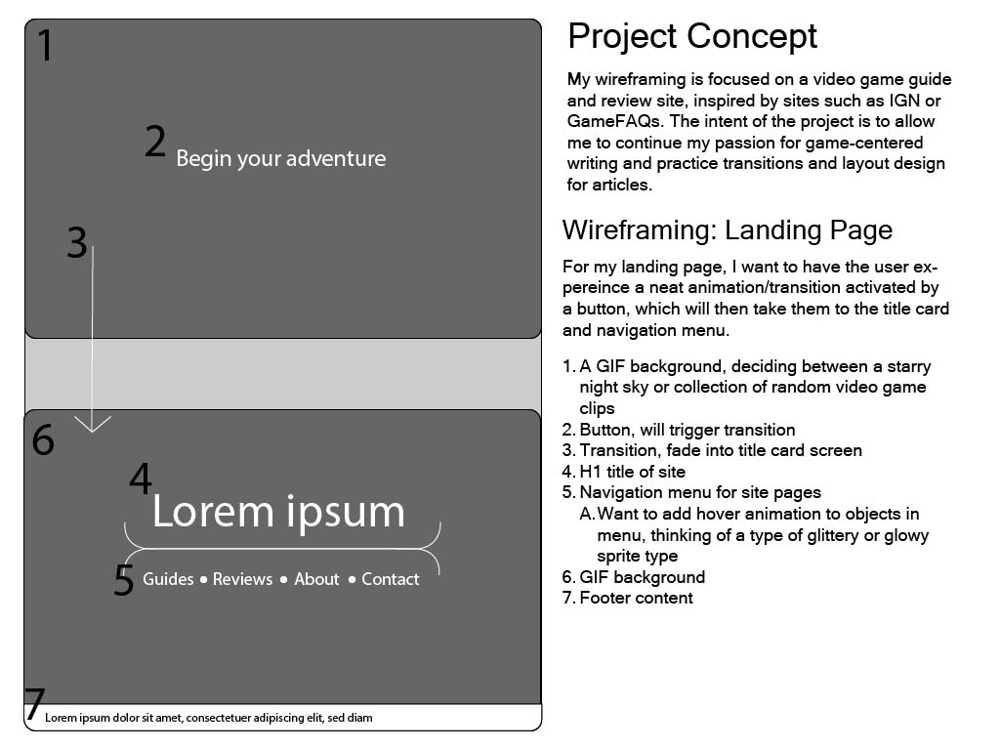
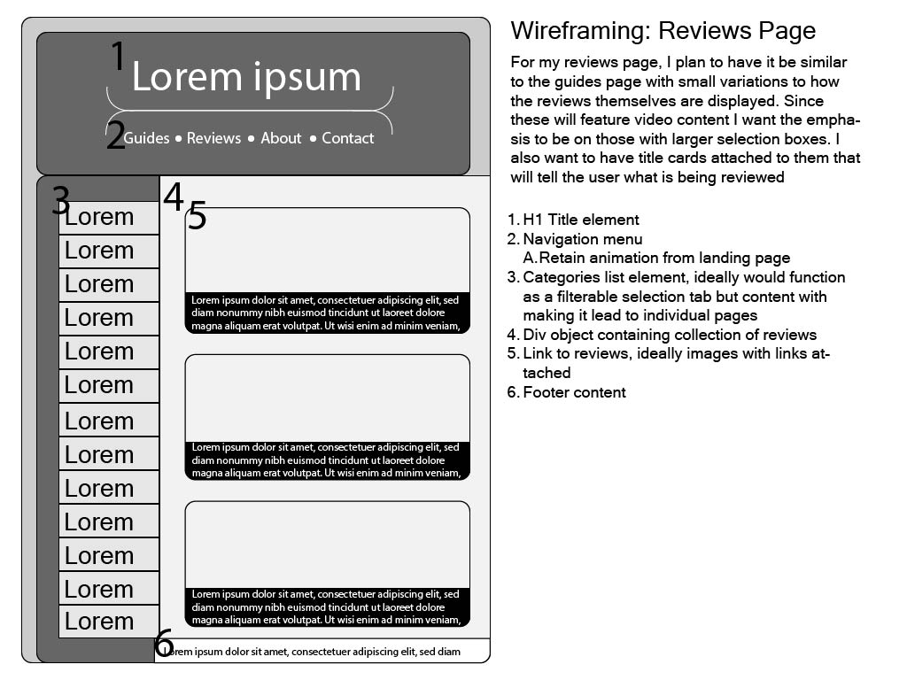
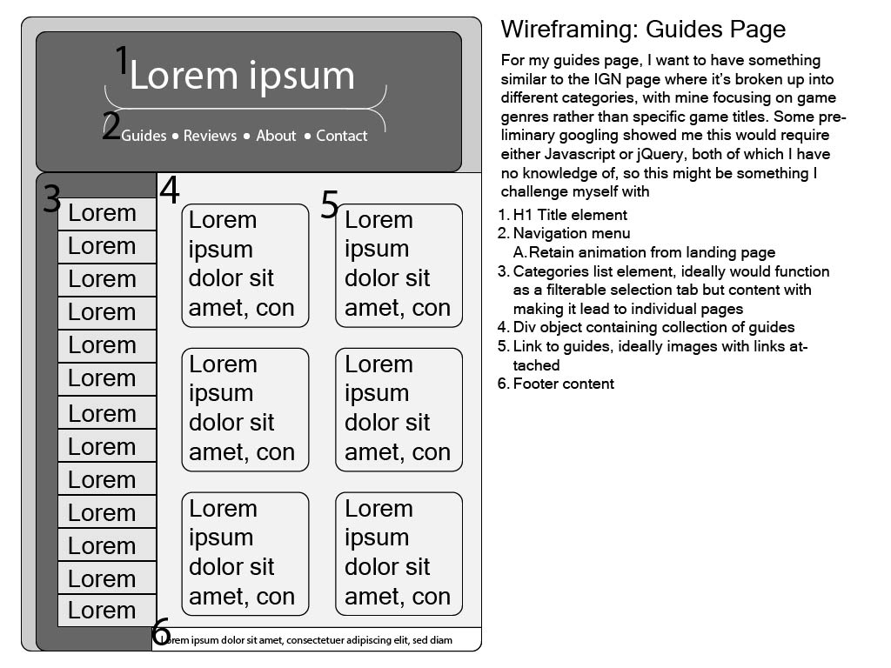
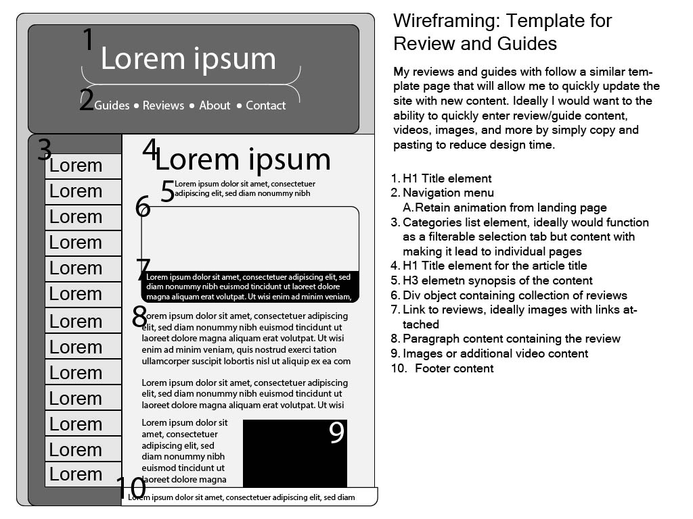
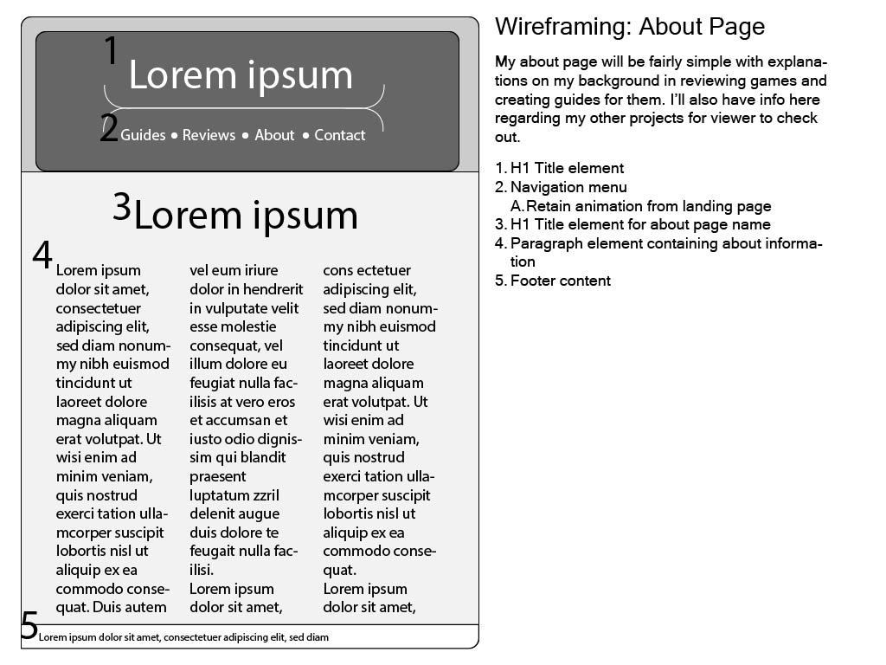
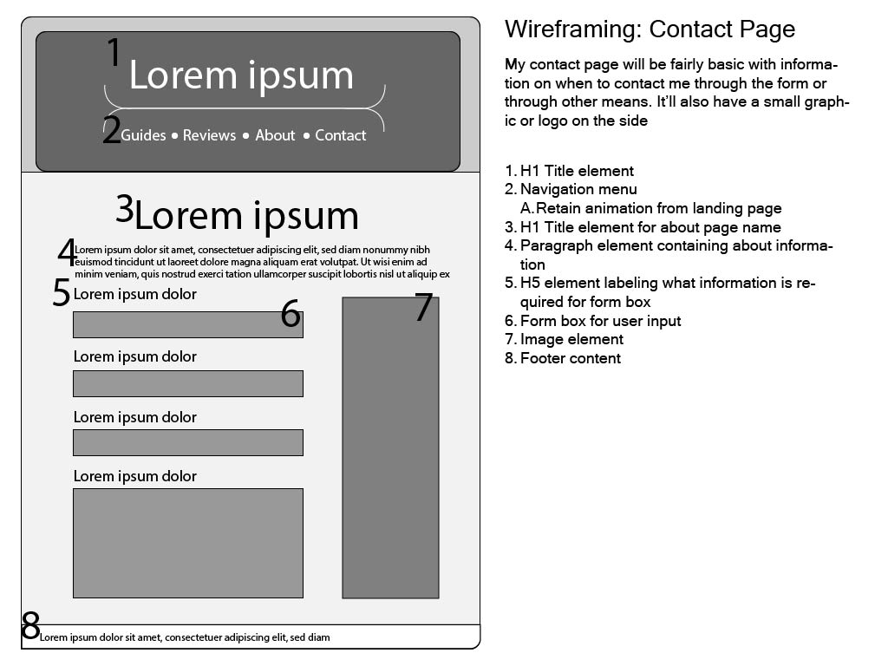

# Josh Spaman's INF6420 Project

A video game review and guide site.

A GIF background, deciding between a starry night sky or collection of random video game clips
Button, will trigger transition
Transition, fade into title card screen
Header
    H1 title of site
    Navigation menu for site pages
        Want to add hover animation to objects in menu, thinking of a type of glittery or glowy sprite type
    GIF background
Footer content
    Creater, copyright info

Header
    H1 Title element
    Navigation menu
    Retain animation from landing page
Content
    Categories list element, ideally would function as a filterable selection tab but content with making it lead to individual pages
    Div object containing collection of reviews
    Link to reviews, ideally images with links attached
Footer content
    Creater, copyright info

Header
    H1 Title element
    Navigation menu
        Retain animation from landing page
Content
    Categories list element, ideally would function as a filterable selection tab but content with making it lead to individual pages
    Div object containing collection of guides
    Link to guides, ideally images with links attached
Footer content
    Creater, copyright info

Header
    H1 Title element
    Navigation menu
        Retain animation from landing page
Content
    Categories list element, ideally would function as a filterable selection tab but content with making it lead to individual pages
    H1 Title element for the article title
    H3 elemetn synopsis of the content
    Div object containing collection of reviews
    Link to reviews, ideally images with links attached
    Paragraph content containing the review
    Images or additional video content
Footer content
    Creater, copyright info

Header
    H1 Title element
    Navigation menu
        Retain animation from landing page
Content
    H1 Title element for about page name
    Paragraph element containing about information
Footer content
    Creater, copyright info

Header
    H1 Title element
    Navigation menu
    Retain animation from landing page
Content
    H1 Title element for about page name
    Paragraph element containing about information
    H5 element labeling what information is required for form box
    Form box for user input
    Image element
Footer content
    Creater, copyright info